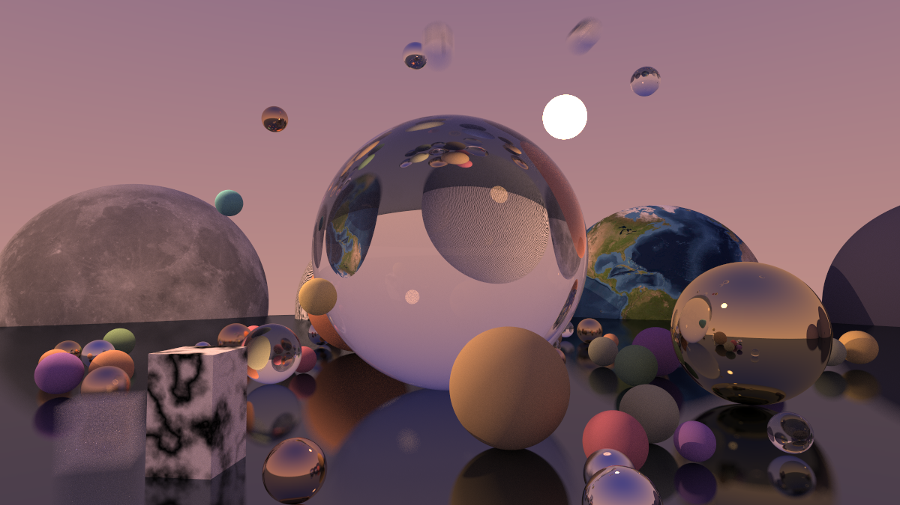

# 🌚 moontrace

Experimental ray tracer written in [Luau](https://luau.org/) with [Lute](https://lute.luau.org/). Early stage.



## Quick Start

Clone the repository:
```sh
git clone https://github.com/prominly/moontrace.git
cd moontrace
```

This project requires the `Lute` runtime. You can find the local setup instructions on this [Page](https://lute.luau.org/guide/installation.html).

Before rendering the scene, you may want to adjust the sample count. This can be done by changing the `SAMPLES` variable at the top of `src/main.luau`.

Performance depends on your hardware, but 10 samples per pixel shouldn't take more than a minute at the moment.
> _the render above took 500 samples per pixel._

Launch:
```sh
lute run src/main.luau
```
> Note: the final image will be in `.ppm` format.

## References

#### Resources

General:
- [Ray Tracing in One Weekend](https://raytracing.github.io/books/RayTracingInOneWeekend.html)
- [Ray Tracing: The Next Week](https://raytracing.github.io/books/RayTracingTheNextWeek.html)
- [Ray Tracing: The Rest of Your Life](https://raytracing.github.io/books/RayTracingTheRestOfYourLife.html)

Textures:
- [Building Up Perlin Noise](http://eastfarthing.com/blog/2015-04-21-noise/)

#### Assets

Textures:
- [earth_texture.jpg](https://science.nasa.gov/earth/earth-observatory/the-blue-marble-true-color-global-imagery-at-1km-resolution/)
- [moon_texture.jpg](https://svs.gsfc.nasa.gov/4720)

